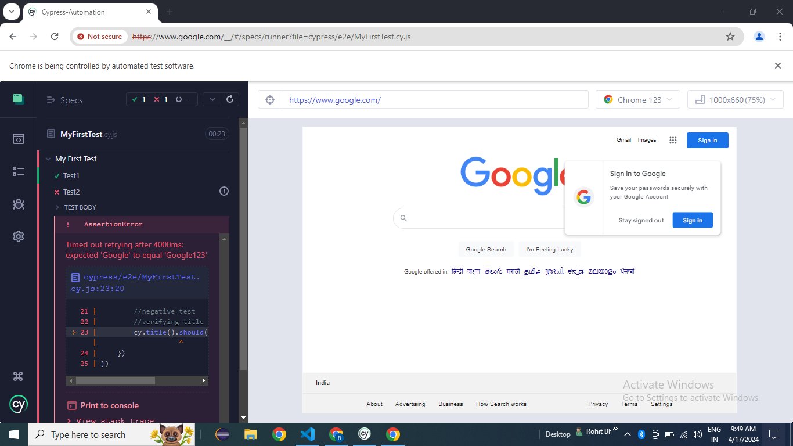
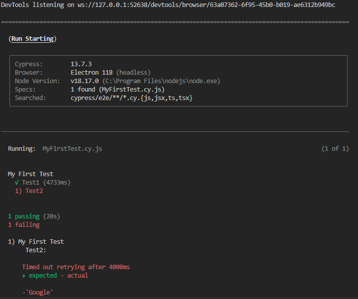
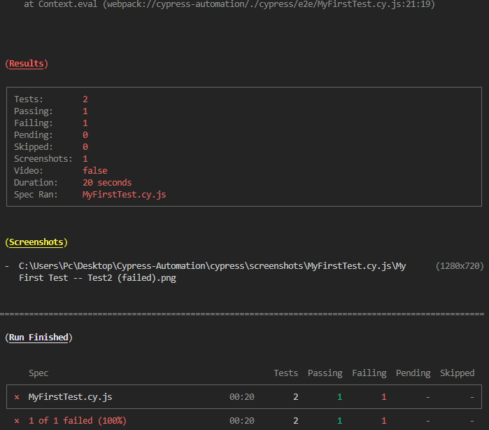

# Cypress-Automation

## Introduction
- Cypress is a Frontend Web Automation testing tool, for modern web applications, developed using latest frameworks like ReactJS, AngularJS etc. 
- We can automate any application which runs on a browser. 
- Cypress uses JavaScript programming language. Typescript (developed on top of javascript) can also be used. 
- Does not use any selenium libraries, unlike other tools built on top of Selenium.
- Cypress is open source.
- Components in Cypress: <strong>Cypress Runner</strong> (free, locally installed), <strong>Cypress Dashboard</strong> (paid service) form the Cypress Ecosystem.
    - <strong>Test Runner</strong> (Cypress App) helps to install cypress, design framework, create tests, write automation test scripts, execute test scripts, debug tests.
    - <strong>Dashboard</strong> helps to record the test, maintain recorded tests, maintain test results history, parallel testing, and maintain dashboards.
- Cypress is build on Node.js environment, in other words we can say, Cypress built on the top of Node.js environment and it comes with a package called NPM (node package manager).

## Who can use Cypress:
- Initially Cypress is developed for developers to do Component level testing: Unit Testing and Integration Testing. Later many features were implemented and testers also started using Cypress. 
- We can automate end-to-end test cases using Cypress. 
- We can automate integration tests, automate unit tests, automate API tests. 
- Both developers and testers can use Cypress for testing.

( Developers will use cypress to perform integration unit test cases and to automate and then QA people will prefer to use cypress to automate end to end test cases and also use for the API testing. )

## Cypress vs Selenium:

<table>
    <tr>
        <th>Diff</th>
        <th>Selenium</th>
        <th>Cypress</th>
    </tr>
    <tr>
        <td>Application Support</td>
        <td>Only Web</td>
        <td>Web and API</td>
    </tr>
    <tr>
        <td>Cost</td>
        <td>Free</td>
        <td>Test Runner is Free, but <br/> Dashboard is paid</td>
    </tr>
    <tr>
        <td>Setup & Installation</td>
        <td>Difficult</td>
        <td>Easier</td>
    </tr>
    <tr>
        <td>Language support</td>
        <td>Java, Python, Ruby, C#, JavaScript</td>
        <td>JavaScript & TypeScript</td>
    </tr>
    <tr>
        <td>Browsers</td>
        <td>Chrome, Edge, Firefox, Safari, Opera, & IE11</td>
        <td>Chrome, Edge, Firefox & Electron</td>
    </tr>
    <tr>
        <td>Framework Support</td>
        <td>JUnit, TestNG, PyTest etc., based on programming language</td>
        <td>Mocha</td>
    </tr>
    <tr>
        <td>Performance</td>
        <td>Runs outside of the browser, so performance is slow when compare with Cypress</td>
        <td>Faster since it runs inside of the browser</td>
    </tr>
    <tr>
        <td>Reporting</td>
        <td>Integrate with Extent, Allure etc</td>
        <td>Mocha reporters, Cypress dashboard</td>
    </tr>
</table>

## Cypress Eco System
1) Test Runner - Open Source locally installed
2) Dashboard - paid

## Features of Cypress:
- <strong style="color: cyan">Time Travel</strong> : for every step executed while executing, Cypress captures snapshot of every run, we can navigate back or move forward in steps.
- <strong style="color: cyan">Debuggability</strong> : Since cypress has access to all DevTools,  Cypress runs on same browser internally, so debugging is easy, crosscheck without rerunning again.
- <strong style="color: cyan">Automatic waits or built-in waits</strong> :  Whenever trying to interact with elements on web page, synchronization issues like page loading slowly, elements may not be available when performing action, elements may be invisible, elements in disabled state, link not available, element detached from DOM structure, then script throws error. Script execution is faster compared to application response. Cypress provides default wait times for everything like wait for element, page load etc. No need to write explicit wait statements in Cypress.
- <strong style="color: cyan">Consistent Results</strong> : Running the same test N number of times, gives the same results, as tests are run in the browser itself in Cypress.
- <strong style="color: cyan">Screenshots and videos</strong> are automatically captured, if something fails. Test cases will be recorded in video format, without writing any additional code. 
- <strong style="color: cyan">Support for cross browser testing</strong> : Run test cases on browsers supported by Cypress, locally or remotely using Jenkins or any other CI/CD tools.
- <strong style="color: cyan">Real time reloads</strong> : Cypress automatically reloads when you make changes to your tests. See the commands executed in real time in your app.

## Limitations of Cypress:
- We cannot automate windows based applications or mobile applications. 
- We have limited support for browsers.
- JavaScript, TypeScript languages are only supported.
- Reading and writing data from files is difficult, have to use third party plugins.
- Reporting using dashboard features or Mocha JS (basic HTML reports). <i>Third party reporting tool integration is also limited</i>.

## About Cypress.io website:
- Developer-friendly as initially developed for developers. 
- Built from scratch without Selenium as base, open source.
- Detailed Guides and Documentation: Web testing, API testing, plugins supported, examples for practice. 
- Cypress helps in setting up tests, writing tests, running tests, debugging tests.

## Cypress E2E (End to End) Web Automation
### Environment Setup on Windows 
- <b>Download & install nodejs</b> (like JRE for Java). Check Path environment variable is set to the installation directory of nodejs. On command prompt: <b style="color: red">node --version, npm --version</b>
    - Download file format: Windows: .msi, Mac: .pkg files
- Download & install visual studio code (VSCode) editor. 
- Create a new folder for the project & open it in VSCode.
- Execute in cmd/terminal below command: <b style="color: red">npm -i init</b> → creates package.json file. <br/>
 We can open terminal from VSCode itself or from the folder location or from search in the taskbar. Give packagename, and leave rest of fields empty or default values, which can be updated later.  
- To install Cypress: <b style="color: red">npm install cypress --save -dev</b> → first time, next: npm install cypress in other projects
- Start Cypress: <b style="color: red">npx cypress open</b> (OR) <b style="color: red">node_modules/.bin/cypress open</b>
- A window opens with packagename:  <br/>
    - E2E(end to end) testing, <br/>
    - Component testing (developers). <br/>
    &rarr; Select E2E testing on Launchpad. <br/> 
    Files created are: cypress.config.js, e2e.js, commands,js, example.json.

- Browsers supported are shown. Electron is the default browser supported in Cypress.
- Select Chrome browser. We can see Specs, Runs, Debug, Settings options.
- Every Spec (specification) is a test case. We can see all sample specs or create an empty Spec in the browser opened.
- In Visual Studio Code, we can see entire framework structure created: 
    - cypress folder: downloads, e2e(to create test cases, has spec files(.cy.js) has multiple test suites:describe block and tests: it blocks) 
    - previous versions: integration folder, fixtures (reusable components), support(configuration files: commands.js, e2e.js default files, can add more)
    - node_modules: cypress related libraries
    - Cypress.config.js, package-lock.son, package.json files

## How to Write & Run Tests in Cypress:
- Every "describe" block represents a test suite, 
- Every "it" block represents one test.

```javascript
    //Using arrow function
    describe('suite name',() => 
    {
        it('test1',() =>
        { 
            expect(true).to.equal(true)
        })
        
        it('test2',() =>
        { 
            expect(true).to.equal(true)
        })  
        
        // …
    })
```

- In Javascript, there are two ways to declaring a function
    - using Arrow function
        ()=>{} arrow function 
    - using normal function
        function() { // steps}  → declare function

```javascript
    //Using declare function
    describe('suite name', function()
    {
        it('test1', function()
        {
            expect(true).to.equal(true)
        })
    })
```

- Create an empty spec file: MyFirstTest.cy.js from browser (npx cypress open: click on .cy.js file => run) or from VSCode.
```Javascript
    describe("My First Test", () => {
        it('Test1', () => {
            //Test steps will go here

            //visiting to Google.com
            cy.visit("https://www.google.com/");

            //positive test
            //verifying title of the page
            cy.title().should('eq', 'Google');
        })

        it('Test2', () => {
            //Test steps will go here

            //visiting to Google.com
            cy.visit("https://www.google.com/");

            //negative test
            //verifying title of the page
            cy.title().should('eq', 'Google123');
        })
    })
```



```note
- A spec file can have n number of describe block/test suite and every describe block can have multiple it block. Every it block is representing one Test, and within it block we can write out test steps

- By default, Cypress will follow Mocha framework to write our tests and all assertions.
```
**Run the test:** 
    - through cypress application: <b style="color: red">npx cypress open: &rarr; click on spec file</b>
    - OR from terminal: <b style="color: red">npx cypress run (default headless mode - no UI)</b> This will run all the spec files headlessly
    
    


- <b style="color: red">npx cypress run –headed</b> (headed mode)
- <b style="color: red">npx cypress run --spec cypress/e2e/MyFirstTest.cy.js --headed </b>
- Default: electron browser, 
- <b style="color: red">npx cypress run --browser chrome</b>  // on chrome browser